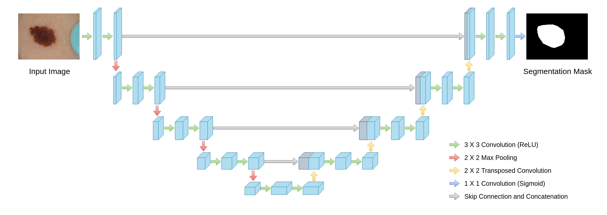
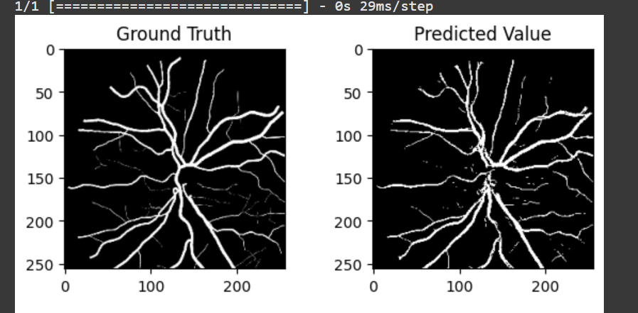
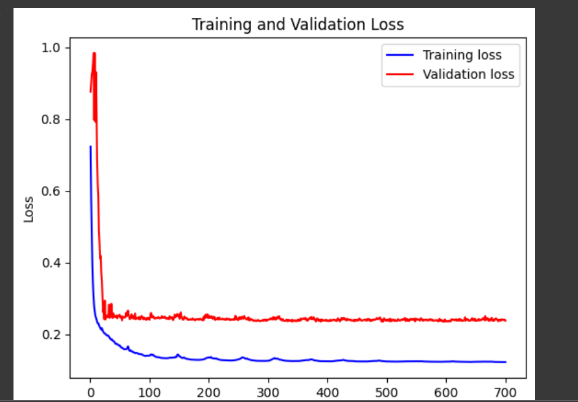

# MultiResUNet for Precise Segmentation of Optic Disc and Blood Vessels in Diabetic Retinopathy

📌 **Overview**

Diabetic Retinopathy (DR) is a leading cause of vision loss, requiring early detection for effective treatment. This project implements MultiResUNet, a deep learning model for the precise segmentation of optic discs and blood vessels from fundus images.

Using MultiResUNet, the model achieves:
- ✅ 98% accuracy in optic disc segmentation
- ✅ 87% accuracy in blood vessel segmentation

This repository contains the model architecture, dataset preprocessing, training scripts, and evaluation metrics for DR segmentation.

📂 **Dataset**

The dataset consists of fundus images with their corresponding segmentation masks for:
- Optic Disc (Class 0)
- Blood Vessels (Class 1)

The images and masks are preprocessed and split into training, validation, and testing sets.

📌 **Methodology**

### 1️⃣ Data Preprocessing
- Resized images to 512x512
- Applied CLAHE (Contrast Limited Adaptive Histogram Equalization) for better contrast
- Normalized pixel values

### 2️⃣ MultiResUNet Architecture
- Enhanced U-Net with multi-resolution blocks
- Uses residual connections to retain spatial information
- Optimized with Dice Loss & Adam Optimizer

**Model Architecture:**

### 3️⃣ Training & Optimization
- 100 epochs with batch size 16
- Learning rate: 0.001 (adaptive with ReduceLROnPlateau)
- Loss function: Dice Coefficient Loss

### 4️⃣ Evaluation Metrics
- ✅ Dice Similarity Coefficient (DSC)
- ✅ Intersection over Union (IoU)
- ✅ Precision & Recall

**Example segmentation results:**

### Visualization

Evaluation Graph:**

📜 **Citations & References**
- MultiResUNet Paper: [https://ieeexplore.ieee.org/document/10543496]
- Dataset Source: [https://www.kaggle.com/datasets/mariaherrerot/idrid-dataset]

🤝 **Contributing**
Contributions are welcome! Feel free to fork this repo, open issues, or submit pull requests.

📩 **Contact**
- 📧 Email: [ashfaqahmd2002@gmail.com]
- 🔗 LinkedIn: [https://www.linkedin.com/in/ashfaq-ahamed-a33225214/]
- 🌐 Website: [https://ashfaq-portfolio-ten-dun.vercel.app/]

Feel free to replace the placeholder paths with the actual paths to your images, masks, and model architecture picture.

